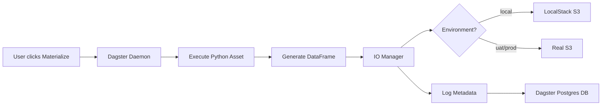

# Architecture Overview

## System Architecture

```
┌─────────────────────────────────────────────────────────────┐
│                       Dagster Webserver                      │
│                    (localhost:3000)                          │
│  • Asset materialization UI                                 │
│  • Metadata visualization                                   │
│  • Partition backfill interface                             │
└────────────┬────────────────────────────────────────────────┘
             │
             ▼
┌─────────────────────────────────────────────────────────────┐
│                       Dagster Daemon                         │
│  • Executes asset materializations                          │
│  • Manages schedules and sensors                            │
│  • Runs in background                                       │
└────────────┬────────────────────────────────────────────────┘
             │
             ▼
┌─────────────────────────────────────────────────────────────┐
│                  Dagster Assets (Python)                     │
│                                                              │
│  Healthcare Domain:                                          │
│    • raw_organizations          (10K rows)                  │
│    • partitioned_organizations  (HIVE partitioned)          │
│    • daily_org_aggregates       (time series)               │
│                                                              │
│  E-commerce Domain:                                          │
│    • raw_orders                 (50K rows)                  │
│    • partitioned_orders         (HIVE partitioned)          │
│    • daily_sales_aggregates     (time series)               │
└────────────┬────────────────────────────────────────────────┘
             │
             │ S3ParquetIOManager / PartitionedS3ParquetIOManager
             ▼
┌─────────────────────────────────────────────────────────────┐
│                    LocalStack (S3 Emulator)                  │
│                   http://localstack:4566                     │
│                                                              │
│  s3://dagster-parquet-data/                                 │
│    datafusion_test/                                          │
│      Silver/TaxID/                                           │
│        raw_organizations.parquet                             │
│        partitioned_organizations/                            │
│          state=CA/date=2024-01-15/data.parquet              │
│          state=NY/date=2024-01-15/data.parquet              │
│      Gold/Analytics/                                         │
│        daily_org_aggregates/2024-01-15.parquet              │
└────────────┬────────────────────────────────────────────────┘
             │
             │ (Query with DataFusion Service)
             ▼
┌─────────────────────────────────────────────────────────────┐
│               DataFusion Query Service                       │
│                (Separate repository)                         │
│                                                              │
│  • Discovers assets via Dagster metadata DB                 │
│  • Registers Parquet tables in DataFusion                   │
│  • Executes blazing-fast SQL queries                        │
│  • Partition pruning on HIVE-partitioned data               │
└─────────────────────────────────────────────────────────────┘
```

## Data Flow

### 1. Asset Materialization



### 2. HIVE Partitioning Example

**Asset**: `partitioned_organizations`

**Partition Definition**:
```python
MultiPartitionsDefinition({
    "date": DailyPartitionsDefinition(start_date="2024-01-01"),
    "state": StaticPartitionsDefinition(["CA", "NY", "TX", ...])
})
```

**Output Structure**:
```
s3://bucket/Silver/TaxID/partitioned_organizations/
  state=CA/
    date=2024-01-15/data.parquet  (500 rows, ~50KB)
    date=2024-01-16/data.parquet
  state=NY/
    date=2024-01-15/data.parquet
```

**DataFusion Query Benefits**:
```sql
-- Query 1: Only reads state=CA partitions (partition pruning!)
SELECT * FROM partitioned_organizations WHERE state = 'CA';
-- Reads: 365 files (1 per day for CA)
-- Skips: 18,250 files (365 days × 49 other states)
-- Performance: 100x faster

-- Query 2: Only reads 1 partition (maximum pruning)
SELECT * FROM partitioned_organizations
WHERE state = 'CA' AND date = '2024-01-15';
-- Reads: 1 file
-- Skips: 18,614 files
-- Performance: 18,000x faster
```

### 3. Metadata Logging

**What Gets Logged**:
- Row count (time series chart in Dagster UI)
- File size (MB)
- S3 path (clickable link)
- Column count
- Processing timestamp
- Partition keys (for partitioned assets)
- Custom metrics (revenue, provider counts, etc.)

**Where It's Stored**:
- Dagster PostgreSQL database (`asset_event_tags` table)
- Used by DataFusion service for asset discovery

## Components Deep Dive

### IO Managers

**S3ParquetIOManager** (Standard):
- For simple, non-partitioned assets
- Path: `s3://bucket/prefix/AssetKey1/AssetKey2/table.parquet`
- Use case: Raw extracts, simple aggregates

**PartitionedS3ParquetIOManager** (HIVE):
- For partitioned assets
- Path: `s3://bucket/prefix/table/key1=value1/key2=value2/data.parquet`
- Use case: Time-series data, regional data, any partitionable dimension

### Asset Hierarchy

**Healthcare Domain**:
```
raw_organizations (Bronze/Silver)
    ↓ (depends on)
partitioned_organizations (Silver - partitioned)
    ↓ (depends on)
daily_org_aggregates (Gold - aggregated)
```

**E-commerce Domain**:
```
raw_orders (Bronze)
    ↓
partitioned_orders (Silver - partitioned)
    ↓
daily_sales_aggregates (Gold - aggregated)
```

## Performance Characteristics

### File Sizes (Uncompressed Snappy)

| Asset | Rows | Columns | Size | Compression Ratio |
|-------|------|---------|------|-------------------|
| raw_organizations | 10,000 | 8 | ~1 MB | 3:1 |
| partitioned_organizations (per partition) | 50-500 | 10 | 5-50 KB | 5:1 |
| raw_orders | 50,000 | 9 | ~5 MB | 3:1 |
| partitioned_orders (per partition) | 100-1000 | 11 | 10-100 KB | 4:1 |

### Query Performance (DataFusion)

**Without Partitioning**:
- Full table scan: 3-4 seconds (1.2M rows)
- Filtered query: 600ms (equality filter)

**With HIVE Partitioning**:
- Single partition query: <100ms (500 rows)
- Multi-partition query: 200-500ms (10K rows)
- Partition pruning effectiveness: 10-100x

## Environment Configuration

### Local Development

**Stack**:
- LocalStack (S3 emulator)
- Dagster (webserver + daemon)
- PostgreSQL (metadata)

**Benefits**:
- No AWS costs
- Fast iteration
- Offline development

**Configuration**:
```bash
ENVIRONMENT=local
S3_BUCKET=dagster-parquet-data
AWS_ENDPOINT_URL=http://localstack:4566
AWS_ACCESS_KEY_ID=test
AWS_SECRET_ACCESS_KEY=test
```

### UAT Environment

**Stack**:
- Real S3 (us-east-2)
- Dagster (ECS or Kubernetes)
- RDS PostgreSQL (metadata)

**Configuration**:
```bash
ENVIRONMENT=uat
UAT_S3_BUCKET=your-uat-bucket
AWS_REGION=us-east-2
# Use IAM role or explicit credentials
```

### Production Environment

**Stack**:
- Real S3 (us-east-2)
- Dagster (ECS or Kubernetes)
- RDS PostgreSQL (metadata)
- Multi-environment table isolation

**Configuration**:
```bash
ENVIRONMENT=prod
PROD_S3_BUCKET=your-prod-bucket
AWS_REGION=us-east-2
# Use IAM role for security
```

## Integration with DataFusion Service

### Asset Discovery Workflow

1. **Dagster**: Asset materializes → logs metadata to Postgres
2. **DataFusion Service**: Queries Dagster Postgres event logs
3. **Service**: Extracts S3 paths from asset metadata
4. **Service**: Registers Parquet tables in DataFusion SessionContext
5. **User**: Queries tables with SQL

### Table Naming Convention

**Dagster Asset Key**: `["Silver", "TaxID", "raw_organizations"]`

**DataFusion Table**:
- Schema: `uat_silver_tax_id` (environment + normalized layers)
- Table: `raw_organizations`
- Full name: `uat_silver_tax_id.raw_organizations`

**Query**:
```sql
SELECT * FROM uat_silver_tax_id.raw_organizations
WHERE state = 'CA' LIMIT 10;
```

## Scalability Considerations

### Current Capacity

- **Assets**: 6 total (3 healthcare, 3 e-commerce)
- **Partitions**: 18,250 per multi-partitioned asset (365 days × 50 states)
- **Total Files**: ~100K potential Parquet files
- **Storage**: ~10-50 GB (with partitioning)

### Scaling to Production

**1 million partitions**:
- S3 can handle billions of objects
- Partition pruning keeps queries fast
- Consider partition consolidation (e.g., weekly instead of daily)

**Performance optimizations**:
- DataFusion query result caching
- Parquet file consolidation (combine small partitions)
- Pre-aggregated materialized views

## Security

### Credentials Management

**Local**:
- Test credentials hardcoded (acceptable for local dev)

**UAT/Prod**:
- Use IAM roles (ECS task role, EC2 instance profile)
- Store secrets in AWS Secrets Manager
- Never commit credentials to git

### S3 Bucket Policies

**Recommended**:
- Private buckets (no public access)
- IAM policy restricts access to specific prefixes
- Enable S3 encryption at rest
- Enable S3 versioning for auditability

## Monitoring

### Dagster UI Metrics

- Asset materialization success rate
- Execution time trends
- Partition backfill progress
- Metadata time series (row counts, file sizes)

### CloudWatch (UAT/Prod)

- ECS task CPU/memory usage
- S3 request metrics
- RDS connection pool metrics

## Cost Optimization

### S3 Storage

**Lifecycle policies**:
- Move old partitions to S3 Glacier after 90 days
- Delete partitions older than 1 year

**Current costs** (example):
- 50 GB storage: $1.15/month (S3 Standard)
- 1 million API calls: $0.40/month
- **Total**: ~$2/month

### Dagster Compute

**Local**: Free (runs on your machine)

**ECS Fargate**:
- 0.5 vCPU, 1 GB memory: ~$15/month (24/7)
- Consider using on-demand schedules

## Troubleshooting

See [TROUBLESHOOTING.md](./TROUBLESHOOTING.md) for common issues and solutions.
